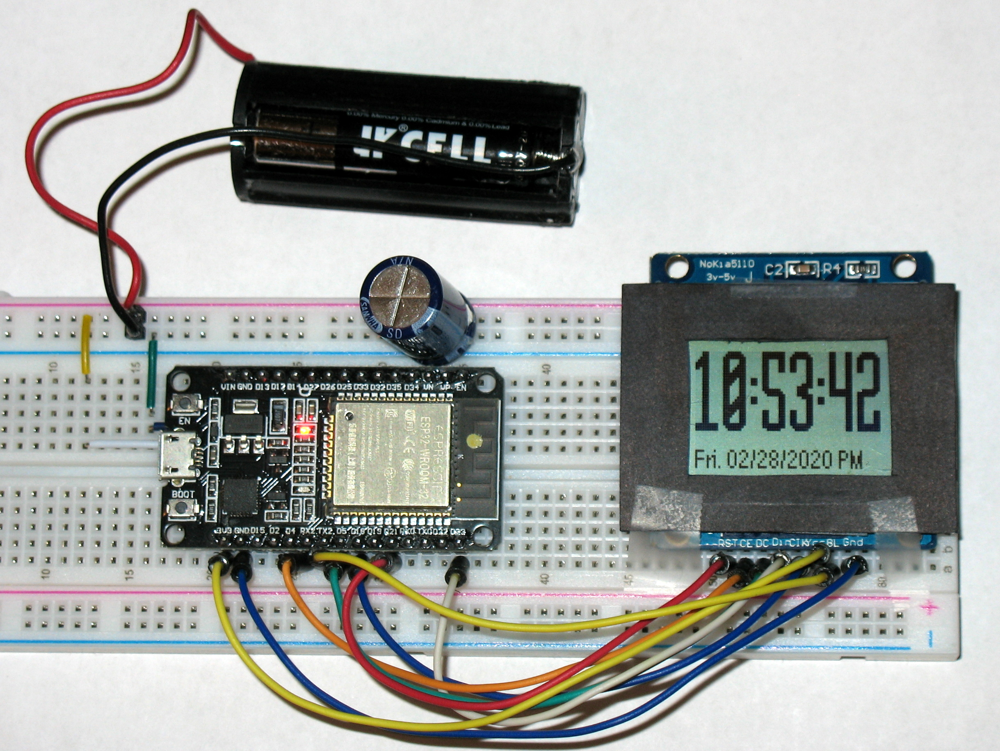
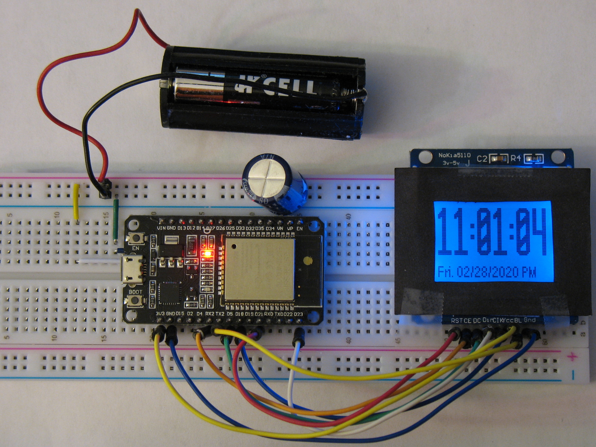

# Clock-ESP32-Nokia5110

Simple clock for ESP32 &amp; Nokia 5110 written in MicroPython.  Using ESP32 DEVKIT.  This script assumes you are already connected to the Internet and pulls UTC time using ntp.  You can set a constant to provide timezone offset.  The program computes local time and sets the RTC to that time.  24-hour or 12-hour operation is selectable with another constant.  This could be done with switches.

#### Pinouts used are:

5110 Pin | 5110 Signal | Description     | ESP32 DEVKIT GPIO | ESP32 DEVKIT Label | ESP32 DEVKIT Pin
:-------:|:-----------------:|:---------------:|:--------------------:|:---------------------:|:-------------------:
5        | CLK               | SPI CLOCK       | 18                   | D18                   | 9
n/a      | n/a               | MISO            | 19                   | D19                   | 10
4        | DIN               | MOSI            | 23                   | D23                   | 15
2        | CE                | Chip Enable/Sel | 16                   | RX2                   | 6
3        | D/C               | Data / Command  | 05                   | D5                    | 8
1        | RST               | Reset           | 21                   | D21                   | 11
7        | BL                | Backlight       | 17                   | TX2                   | 7

#### Required libraries:

pcd8544_fb.py (https://github.com/mcauser/micropython-pcd8544/blob/master/pcd8544_fb.py)

writer.py (https://github.com/peterhinch/micropython-font-to-py/blob/master/writer/writer.py)

arialn11.py (https://github.com/the-stanely/Clock-ESP32-Nokia5110/blob/master/arialn11.py)

marrada30.py (https://github.com/the-stanely/Clock-ESP32-Nokia5110/blob/master/marrada30.py).  This font file only includes characters ' 0123456789:.' for the clock.

